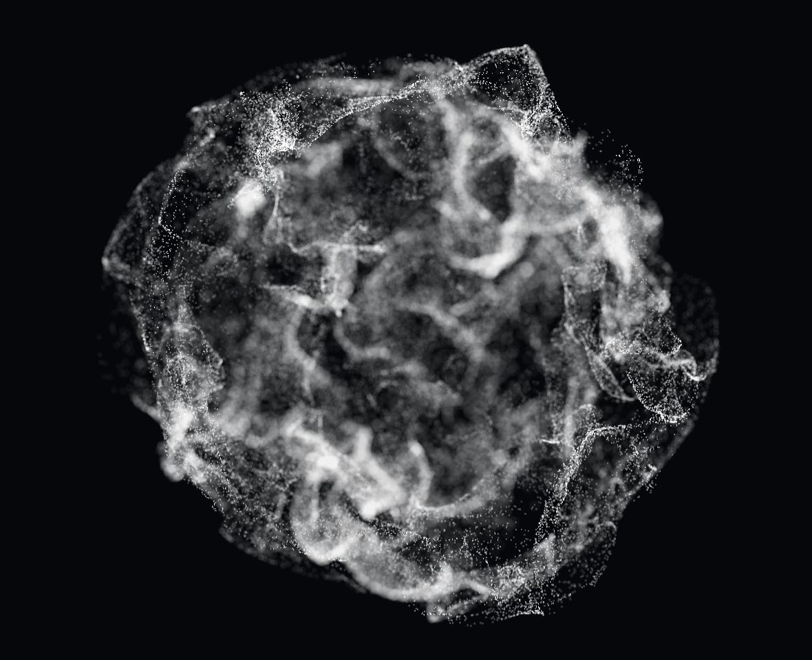
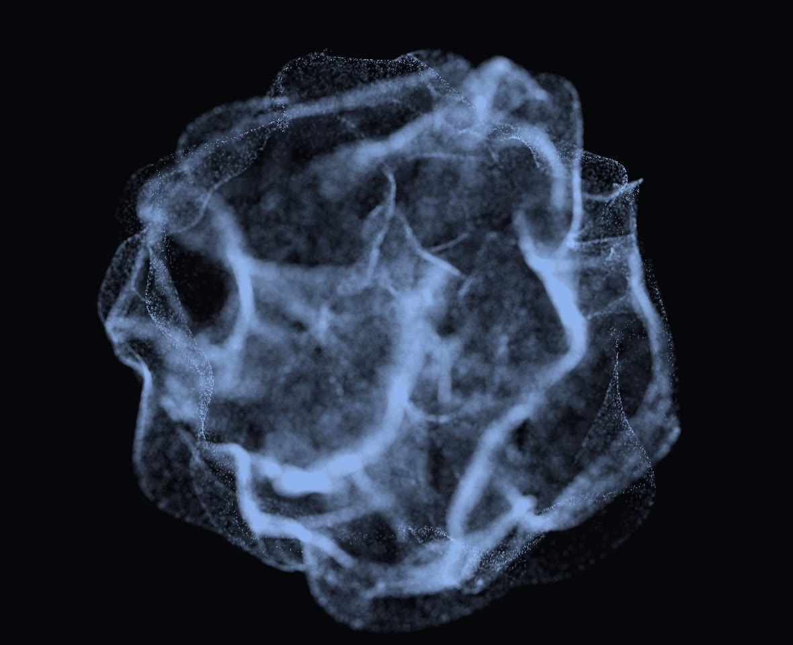
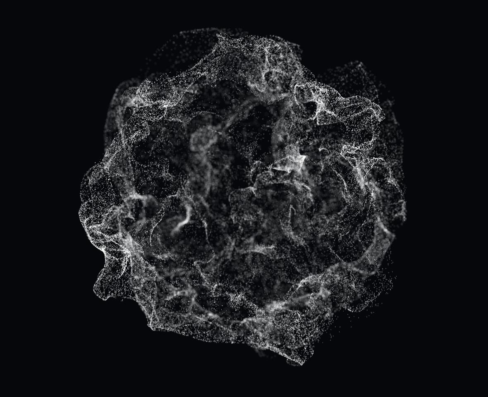
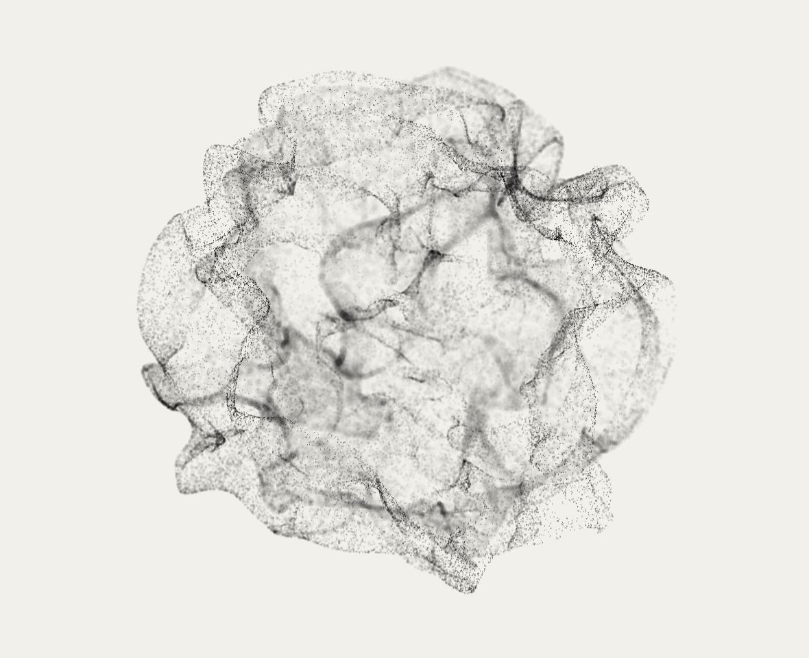

# Driftfield

A cloud of points living inside a curl-noise flow field, with a lens in front of it. Everything you
can see is on a slider: how many points there are, what the field does to them, and how much of the
result the lens keeps in focus.

**Live demo:** https://kloserock97-tech.github.io/driftfield/



## The idea

Nothing here is simulated over time. There is no particle state and no velocity buffer carried from
one frame to the next. Each point knows one thing: where it started. Its position for the current
frame is a pure function of that seed and the clock, recomputed in the vertex shader every frame.

That one decision pays for most of the good behaviour:

- **Time is a number, not a history.** Freeze it, scrub it backwards, jump it forward. The cloud
  reassembles itself exactly, because there is nothing to reassemble.
- **The point count is a slider.** No warm-up, no respawn, no gaps. Drag it from five thousand to two
  hundred thousand and the shape stays the same, just denser.
- **A dropped frame costs nothing.** Skipped time is skipped, not accumulated as drift.

## How the shape happens

The velocity comes from the curl of a noise potential. A curl has zero divergence by construction, so
the flow has no sources and no sinks: points never pile into clumps and never drain out of the frame.

Each point then takes three steps.

1. **Landing.** The field direction at the seed, normalised, is a point on the unit sphere. That one
   normalisation is why the cloud comes out round; there is no sphere anywhere in the code.
2. **Tracing.** From that point it follows the field for a few short strides, each shorter than the
   last and sampled at a finer scale, the way you would integrate a streamline. Seeds that land close
   together walk the same path, and that is what draws threads instead of noise.
3. **Spray.** A slow noise over the sphere decides how far each patch sits from the shell. It is left
   unclamped: where it dips the points sink inside, where it peaks they are thrown out, so the
   silhouette tears instead of staying a clean ball.

## The lens

Depth of field is computed with the thin-lens formula rather than faked with a size ramp. The blur
disc grows with the distance from the plane of focus relative to the point's own distance, and the
aperture is an f-number: 1.4 is wide open and melts everything outside the focus, 16 keeps the whole
cloud crisp. A point's light is spread over its disc, so brightness falls with the ratio of the areas,
which is what gives sharp grain on top of soft haze.

The discs are drawn with alpha compositing rather than added light. Added light has no ceiling and
burns dense regions to flat white; alpha saturates towards the particle colour and keeps the structure
readable in the thickest part of the cloud.

## Controls

| Group | What it does |
| --- | --- |
| **points** | how many are drawn, 5k to 200k |
| **seed spread** | how far apart neighbours start in the noise: small values give threads, large ones give dust |
| **radius** | size of the cloud in world units |
| **frequency** | field scale: low is broad sheets, high is fine tangles |
| **speed** | how fast the field moves through itself |
| **spray** | points pulled inside the shell (negative) or thrown off it (positive) |
| **trace steps** | how far each point follows the streamline, 0 to 6 |
| **sampling** | 6 probes per curl (central differences) or 3 (about a third cheaper) |
| **focus / f-stop** | plane of focus and aperture, like a real lens |
| **point size / opacity / colours** | the rest of the look |

`H` hides the panel, `Space` freezes time, drag to orbit, scroll to zoom.

Five presets are included (bubble, nebula, threads, ember, ink). **Copy link to this look** puts the
whole setup in the address bar, so a version you liked can be sent to someone as a plain URL.

| nebula | threads | ink |
| --- | --- | --- |
|  |  |  |

## Performance

One draw call of `gl.POINTS`. The cost is almost entirely noise sampling in the vertex shader: a curl
with six probes reads the potential eighteen times, and a point evaluates one curl to land plus one per
trace step. If the frame rate drops, the useful dials are **trace steps** and **sampling**; the shape
survives both.

On an Intel Arc integrated GPU the defaults (80k points, six probes, three trace steps) run at about
110 fps at 1368×775.

## Running it

Node 22 or newer.

```bash
npm install
npm run dev       # http://localhost:5173
npm run build     # static site into dist/
npm run preview
```

`.github/workflows/deploy.yml` publishes `dist/` to GitHub Pages on every push to `main`.

Three files matter: `src/field.glsl.js` is the field and the lens as shader source,
`src/main.js` wires the scene and the panel, `src/settings.js` holds defaults, presets and the URL
encoding. No models, no textures, no data files — the whole thing is code.

## Prior art

Particles carried by a curl-noise field are a common building block in real-time graphics. The
construction here (streamline tracing from a landing point on the sphere, noise-driven spray, a
thin-lens depth of field with an f-number) and all of the code are my own. Built with
[three.js](https://threejs.org) and [lil-gui](https://lil-gui.georgealways.com).

## Licence

MIT — see [LICENSE](LICENSE).

Nikita Gorbachev · kloserock97@gmail.com ·
[LinkedIn](https://www.linkedin.com/in/nikita-gorbachev-productdesigner)
